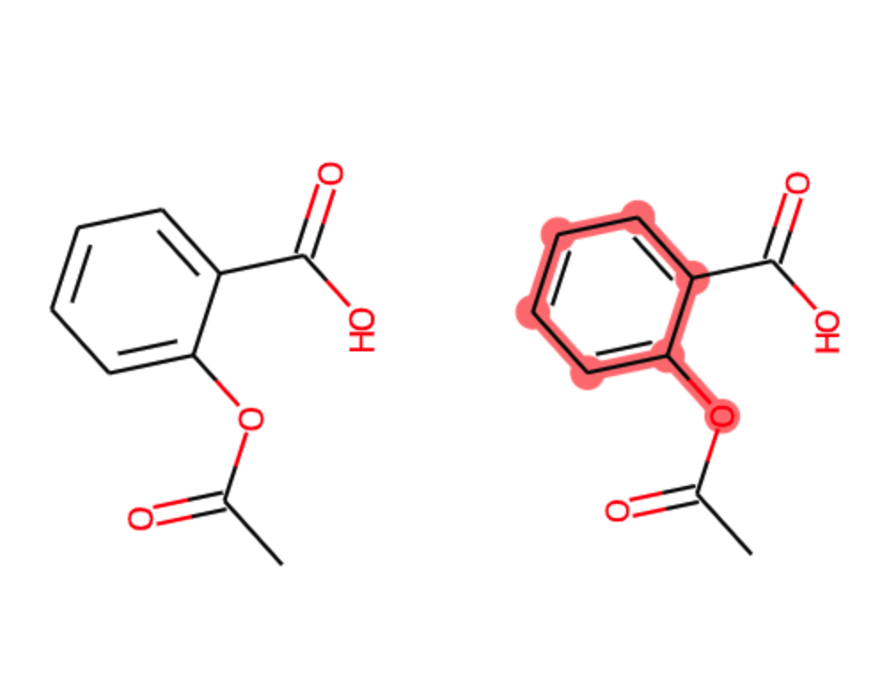
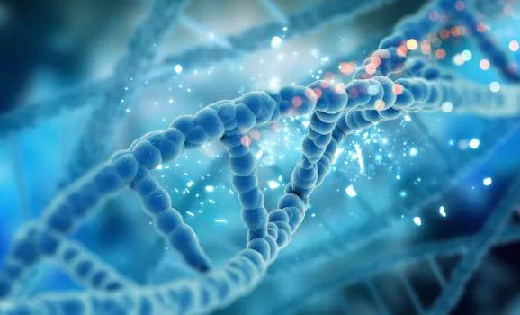
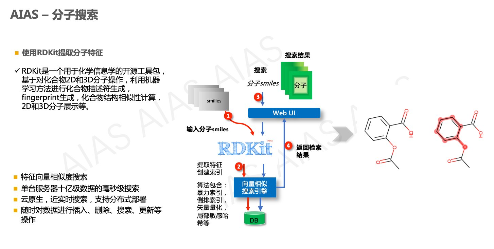
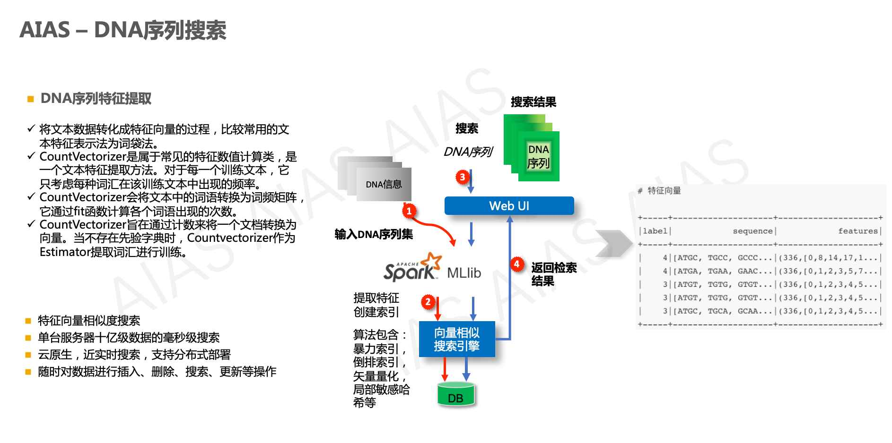

## Bioinformatics
Includes chemical molecular toolkits, DNA toolkits, DNA sequence search, molecular search, and more.

### Toolboxes

  <table>
    <tr>
      <td>
        

        	
Chemical Molecular Toolkits

        

      </td>    	
      <td>
        

        
        

      </td>
    </tr> 
    <tr>
      <td style="width:220px">
        

        	
DNA Toolkits

        

      </td>    	
      <td>
        

        
        

      </td>
    </tr>                                     
  </table>

### Search

  <table>
    <tr>
      <td>
        

        	
Molecular Search

        

      </td>    	
      <td>
        

        
        

      </td>
    </tr> 
    <tr>
      <td style="width:220px">
        

        	
DNA Sequence Search

        

      </td>    	
      <td>
        

        
        

      </td>
    </tr>                                           
  </table>

#### Other Open Source Projects:

#### 1. AI Accelerator Suite

- GitHub: https://github.com/mymagicpower/AIAS

#### 2. AI + Quantum Computing

- GitHub: https://github.com/mymagicpower/qubits
